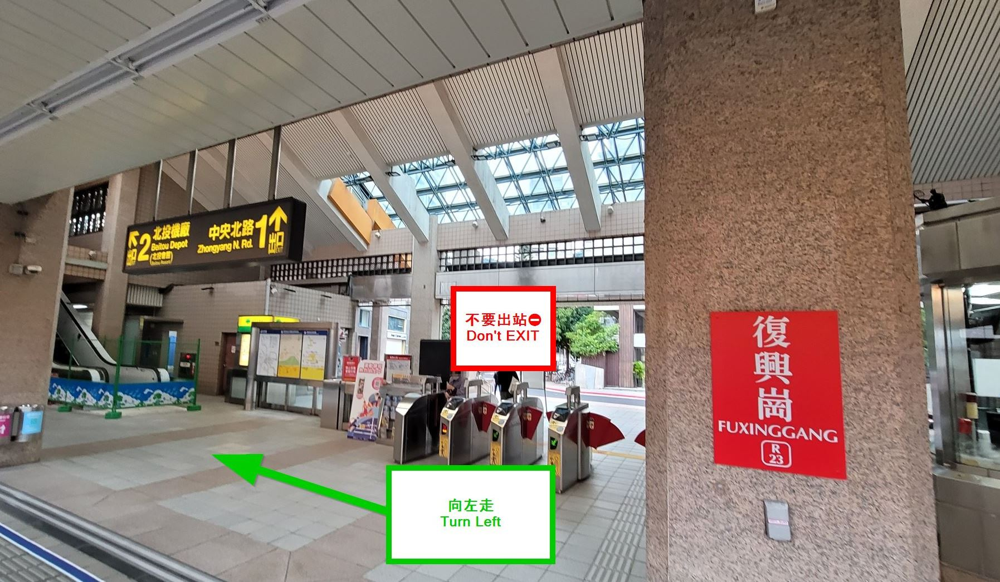
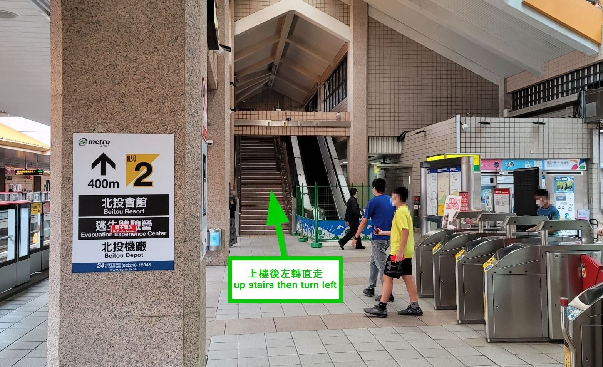
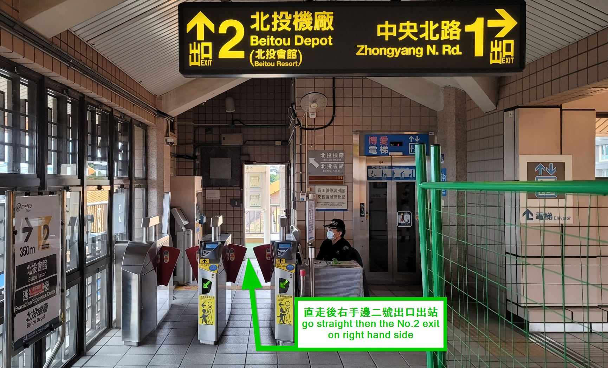
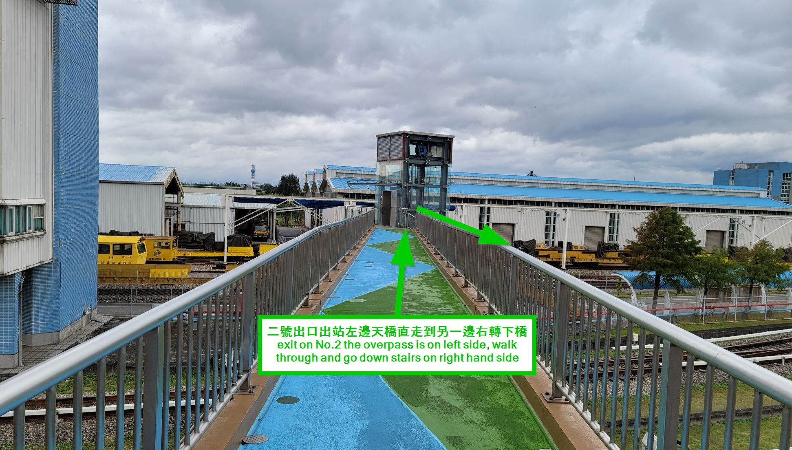
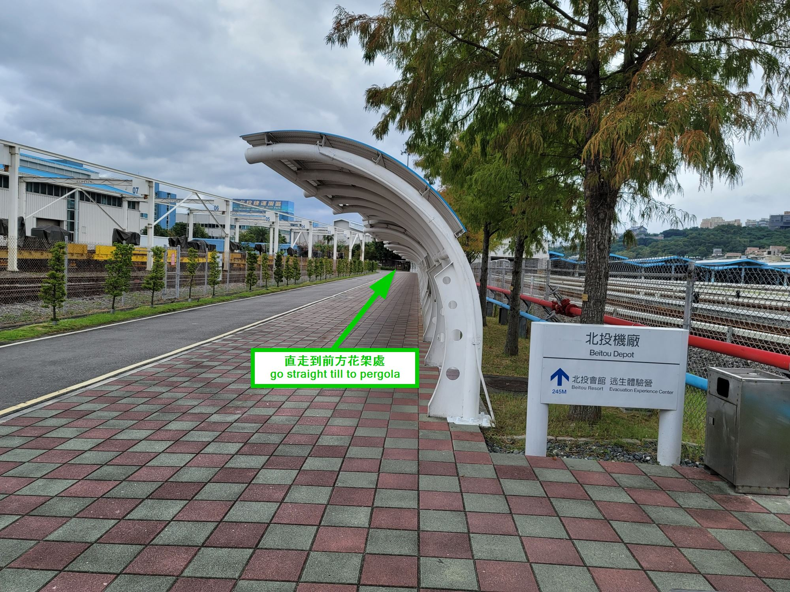
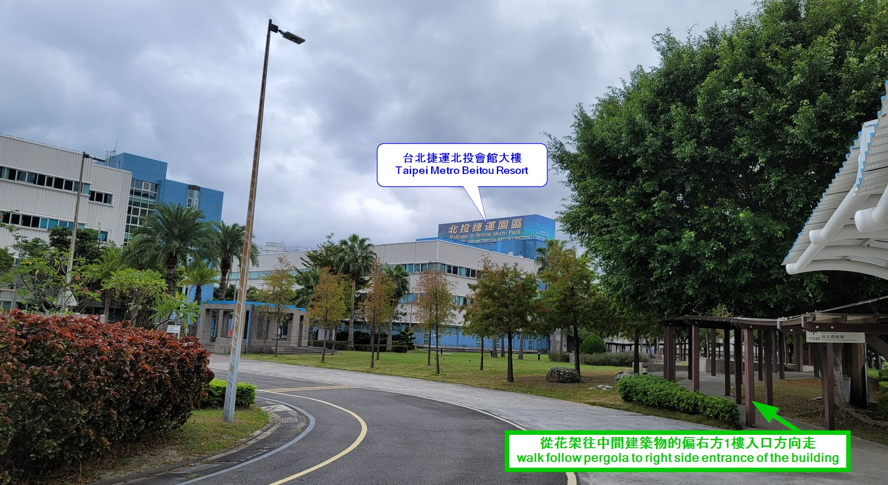
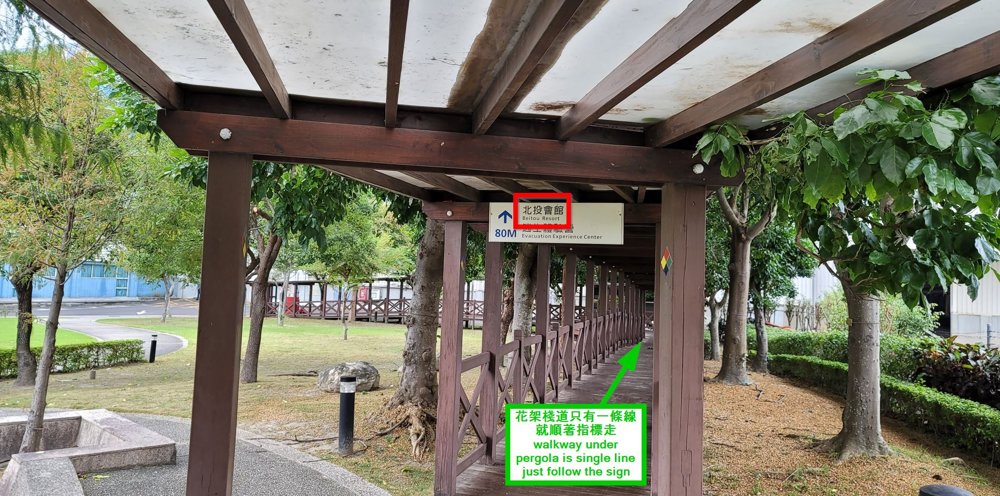
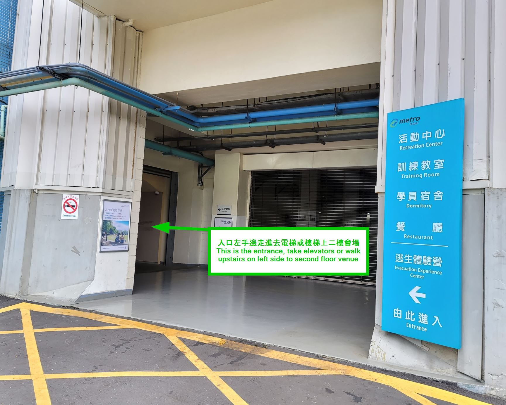

# 坐台北捷運到DDD大會會場(台北捷運北投會館)

1. 從台北火車站方向坐紅線到復興崗站下車，記住，不要出站，向左轉。
    
2. 上樓後左轉。
    
3. 直走會看到右手邊有警衛的二號出口出站。
    
4. 二號出口出站左邊天橋直走到另一邊右轉下橋。
    
5. 直走到前方花架處。
    
6. 從花架往中間建築物的偏右方1樓入口方向走。
    
7. 花架棧道只有一條線就順著指標走。
    
8. 花架棧道走到底即北投會館入口，入口左手邊走進去有電梯或樓梯上二樓，就是會場。
    